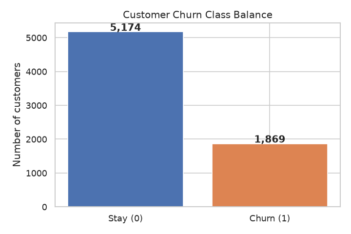
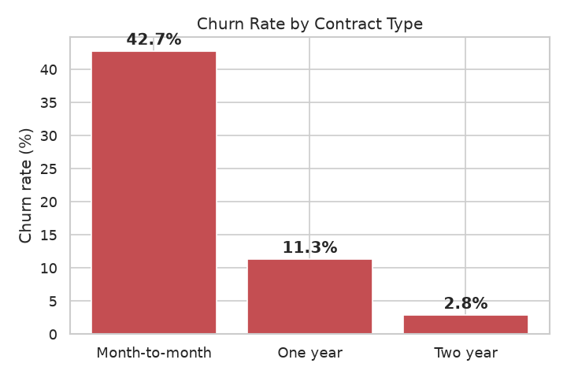
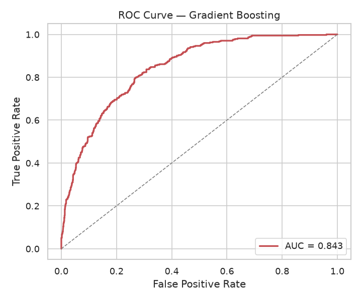
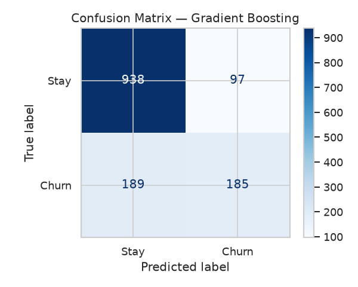
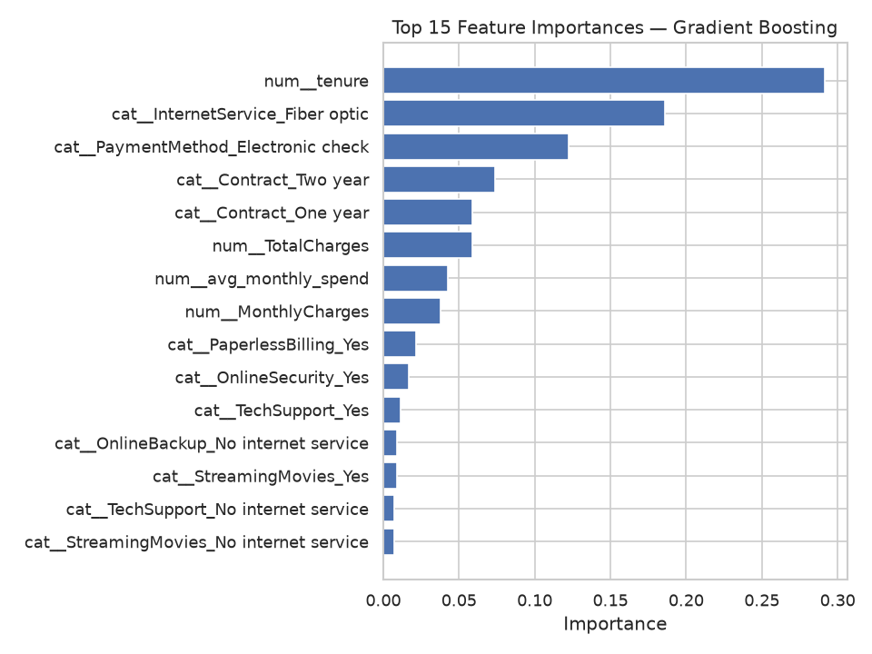
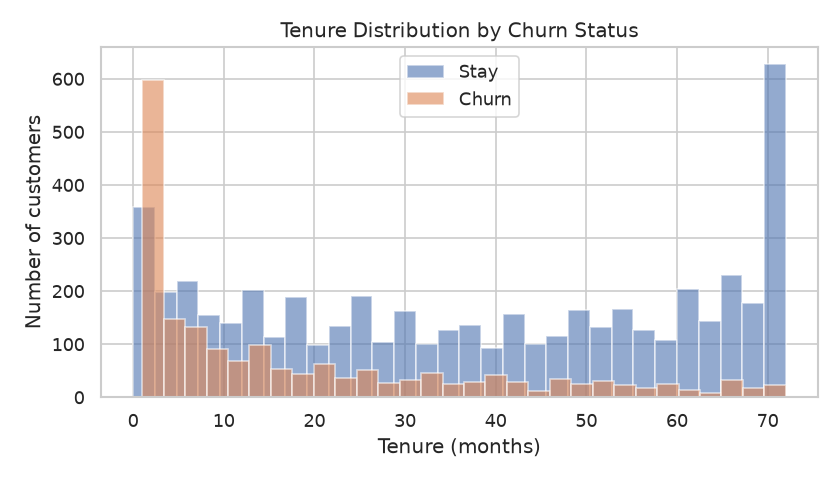

# 📉 Telco Customer Churn Prediction

An end-to-end machine learning project that predicts which telecom customers are
likely to **churn** (cancel their service) so the business can target retention
offers *before* they leave. Built to demonstrate the full data-science workflow:
data cleaning → EDA → feature engineering → modeling → evaluation → business
recommendations.

> **Why this project?** Churn prediction is one of the most common and highest-value
> ML use cases in industry (telecom, SaaS, banking, insurance). It showcases
> classification, handling imbalanced data, model comparison, interpretability, and —
> crucially — translating a model into a concrete business action. It is small enough
> to fully understand and explain in an interview, but realistic enough to be credible
> on a portfolio.

---

## 📋 Table of Contents
- [Business Problem](#-business-problem)
- [Dataset](#-dataset)
- [Tools & Libraries](#-tools--libraries)
- [Project Structure](#-project-structure)
- [Workflow](#-workflow)
- [Results](#-results)
- [Key Insights & Recommendations](#-key-insights--recommendations)
- [How to Run](#-how-to-run)
- [Future Improvements](#-future-improvements)
- [Assumptions & Limitations](#-assumptions--limitations)

---

## 🎯 Business Problem

A telecom company loses recurring revenue every time a customer cancels. Because
acquiring a new customer costs far more than keeping an existing one, even a small
reduction in churn has a large financial impact.

- **Objective:** classify customers by churn risk and surface the *drivers* of churn.
- **Expected users:** retention / CRM teams, marketing, customer-success leadership.
- **Real-world use case:** score the active customer base monthly, rank by churn
  probability, and route the highest-risk customers into targeted retention campaigns.

---

## 📊 Dataset

**IBM "Telco Customer Churn"** — a widely used public dataset.

- **Rows:** 7,043 customers
- **Columns:** 21 (demographics, subscribed services, account/contract info, charges)
- **Target:** `Churn` (Yes / No) — overall churn rate ≈ **26.5%** (imbalanced)
- **Source:** [IBM Telco Customer Churn](https://www.ibm.com/docs/en/cognos-analytics/12.0.x?topic=samples-telco-customer-churn) ·
  mirrored on [Kaggle (blastchar)](https://www.kaggle.com/datasets/blastchar/telco-customer-churn)

The CSV is included at `data/raw/Telco-Customer-Churn.csv` for reproducibility.

---

## 🛠 Tools & Libraries

| Purpose | Tools |
|---|---|
| Language | Python 3.9+ |
| Data wrangling | Pandas, NumPy |
| Modeling | Scikit-learn (Logistic Regression, Random Forest, Gradient Boosting) |
| Visualization | Matplotlib, Seaborn |
| Notebook | Jupyter |
| Persistence | joblib |

---

## 📁 Project Structure

```
churn-prediction/
├── data/
│   └── raw/
│       └── Telco-Customer-Churn.csv      # Public IBM dataset (7,043 rows)
├── notebooks/
│   └── churn_analysis.ipynb              # Full narrated analysis with outputs
├── src/
│   ├── data_preprocessing.py             # Load + clean data
│   ├── feature_engineering.py            # Derived features + preprocessing pipeline
│   ├── model_training.py                 # Train, compare, evaluate, save models
│   ├── visualization.py                  # EDA + evaluation plots
│   └── main.py                           # One-command end-to-end runner
├── models/
│   └── churn_model.joblib                # Best fitted pipeline (regenerated by main.py)
├── reports/
│   ├── metrics.json                      # Model comparison metrics
│   └── figures/                          # Saved PNG charts
├── requirements.txt
├── .gitignore
├── PROJECT_SUMMARY.md                    # One-page summary for quick review
└── README.md
```

---

## 🔄 Workflow

1. **Data loading & cleaning** (`data_preprocessing.py`)
   - Drop the non-predictive `customerID`.
   - Convert `TotalCharges` from text to numeric; impute 11 blank values (tenure-0
     customers) with 0.
   - Encode the `Churn` target to 1/0.
2. **Exploratory data analysis** (`visualization.py`)
   - Class balance, churn by contract type, tenure distribution, numeric correlations.
3. **Feature engineering** (`feature_engineering.py`)
   - `tenure_group`, `avg_monthly_spend`, `has_streaming`.
   - Leak-free `ColumnTransformer`: scale numerics + one-hot encode categoricals.
4. **Model building & comparison** (`model_training.py`)
   - Logistic Regression, Random Forest, Gradient Boosting in a single pipeline.
   - Stratified 80/20 split; balanced class weights where supported.
5. **Evaluation**
   - ROC-AUC (primary, due to imbalance), plus accuracy, precision, recall, F1.
   - Confusion matrix, ROC curve, feature importance.
6. **Business interpretation** — translate drivers into retention actions.

---

## 📈 Results

Models evaluated on a held-out stratified test set (1,409 customers). **Gradient
Boosting** was selected as the best model by ROC-AUC.

| Model | Accuracy | Precision | Recall | F1 | ROC-AUC |
|---|---|---|---|---|---|
| Logistic Regression | 0.738 | 0.504 | **0.786** | 0.614 | 0.842 |
| Random Forest | 0.762 | 0.545 | 0.628 | 0.584 | 0.825 |
| **Gradient Boosting** ⭐ | **0.797** | **0.656** | 0.495 | 0.564 | **0.843** |

> *Metrics are produced by actually running the pipeline on the real dataset
> (`reports/metrics.json`) — no fabricated numbers.*

**Note on metric choice:** Logistic Regression has the highest *recall* (catches more
churners) thanks to balanced class weights, which can be preferable when missing a
churner is costly. Gradient Boosting gives the best overall ranking (ROC-AUC) and
accuracy. The right operating point depends on the business cost of false negatives
vs. false positives — see [Future Improvements](#-future-improvements).

### Visualizations

| | |
|---|---|
|  |  |
|  |  |
|  |  |

---

## 💡 Key Insights & Recommendations

**Top churn drivers** (from feature importance):
- **Short tenure** — new customers are the most fragile; the first year is critical.
- **Month-to-month contracts** — by far the highest-churn segment.
- **Fiber-optic internet** and **electronic-check payments** correlate with higher churn.
- **No tech support / online security** add-ons increases churn risk.

**Recommended retention actions:**
1. Incentivize month-to-month customers to switch to annual contracts.
2. Launch an early-life onboarding/retention program in the first 12 months.
3. Promote auto-pay (card/bank) over electronic check to reduce payment friction.
4. Bundle tech support / security add-ons, especially for fiber customers.

---

## ▶️ How to Run

```bash
# 1. Clone and enter the project
git clone https://github.com/<your-username>/churn-prediction.git
cd churn-prediction

# 2. (Recommended) create a virtual environment
python -m venv .venv
source .venv/bin/activate        # Windows: .venv\Scripts\activate

# 3. Install dependencies
pip install -r requirements.txt

# 4a. Run the full pipeline (cleans data, trains models, saves model + figures)
python src/main.py

# 4b. OR explore the narrated analysis notebook
jupyter notebook notebooks/churn_analysis.ipynb
```

Running `src/main.py` prints the model comparison table, saves the best model to
`models/churn_model.joblib`, writes metrics to `reports/metrics.json`, and refreshes
all figures in `reports/figures/`.

---

## 🚀 Future Improvements

- Hyperparameter tuning (GridSearchCV / Optuna) and **probability-threshold tuning**
  aligned to the business cost of false negatives vs. false positives.
- Try **XGBoost / LightGBM** and add **SHAP** for per-customer explanations.
- Deploy as a **FastAPI** service or scheduled batch-scoring job.
- Add **data-drift monitoring** and automated retraining.

---

## ⚠️ Assumptions & Limitations

- The dataset is a *fictional* IBM sample; absolute figures will differ from any real
  company, but the workflow and feature relationships are realistic.
- 11 tenure-0 customers had blank `TotalCharges`, imputed with 0.
- Models use mostly default hyperparameters; this is intentional to keep the project
  small and interpretable. Production work would add tuning and monitoring (above).

---

*Built by **Naveen** as a portfolio project demonstrating end-to-end data science and
ML engineering skills.*
