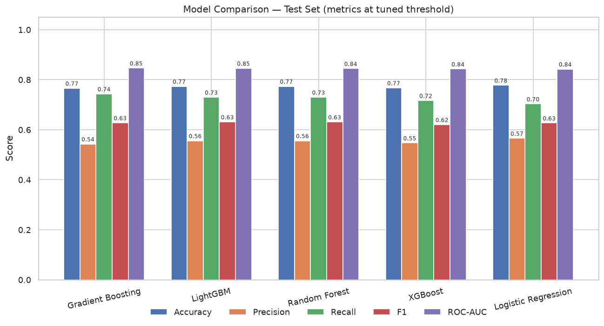
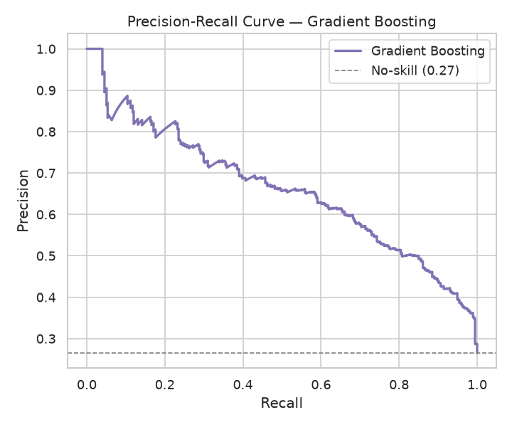
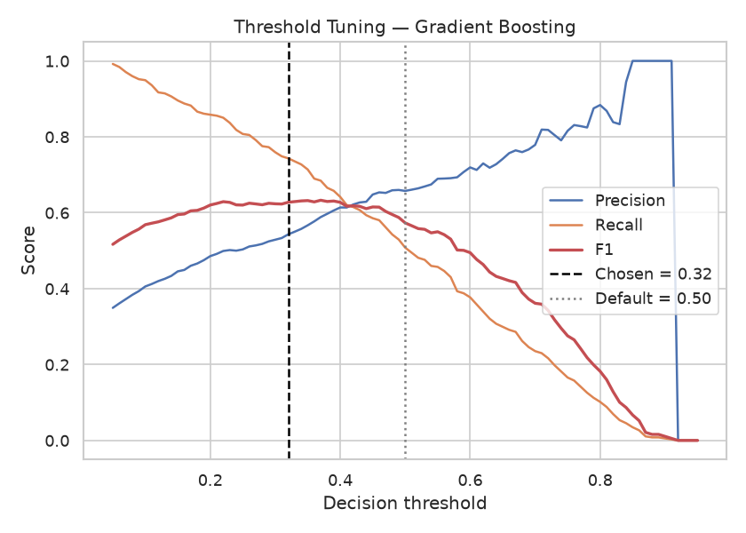
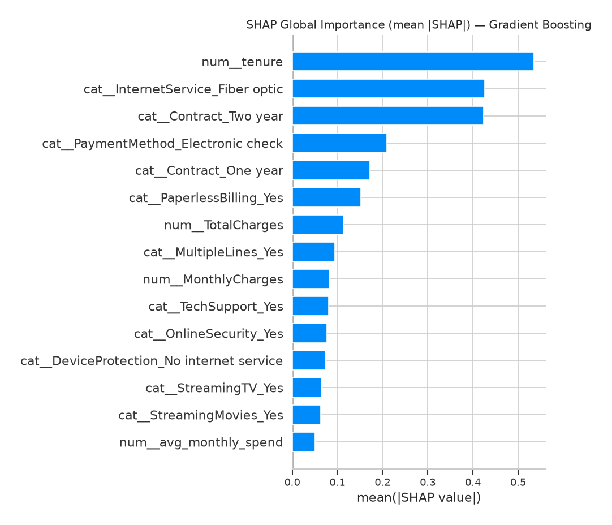
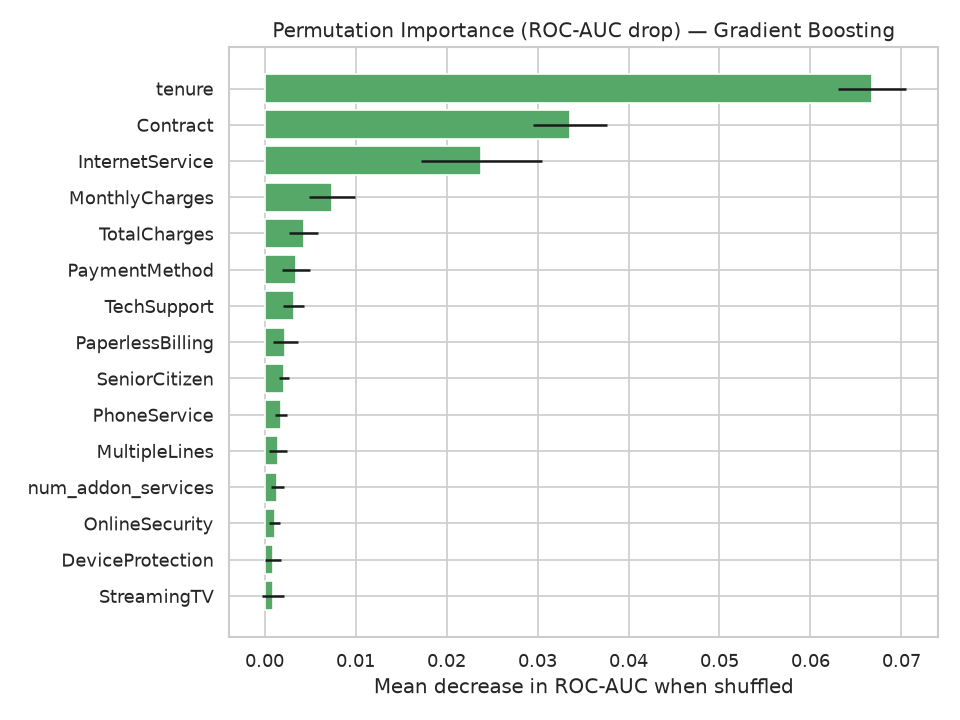

# 📉 Telco Customer Churn Prediction

An end-to-end machine learning project that predicts which telecom customers are
likely to **churn** (cancel their service) so the business can target retention
offers *before* they leave. It covers the full data-science workflow:
data cleaning → EDA → feature engineering → **multi-model comparison** →
**cross-validation** → **hyperparameter tuning** → **threshold optimization** →
**model explainability (SHAP + permutation importance)** → business recommendations.

> **Why this project?** Churn prediction is one of the most common and highest-value
> ML use cases in industry (telecom, SaaS, banking, insurance). It showcases
> classification, handling imbalanced data, model comparison, interpretability, and —
> crucially — translating a model into a concrete business action. It is small enough
> to fully understand and explain in an interview, but realistic enough to be credible
> on a portfolio.

---

## 📋 Table of Contents
- [Business Problem](#-business-problem)
- [Dataset](#-dataset)
- [Tools & Libraries](#-tools--libraries)
- [Project Structure](#-project-structure)
- [Workflow](#-workflow)
- [Results](#-results)
- [Model Explainability](#-model-explainability)
- [Key Insights & Recommendations](#-key-insights--recommendations)
- [How to Run](#-how-to-run)
- [Methodology Notes (for interviews)](#-methodology-notes-for-interviews)
- [Future Improvements](#-future-improvements)
- [Assumptions & Limitations](#-assumptions--limitations)

---

## 🎯 Business Problem

A telecom company loses recurring revenue every time a customer cancels. Because
acquiring a new customer costs far more than keeping an existing one, even a small
reduction in churn has a large financial impact.

- **Objective:** classify customers by churn risk and surface the *drivers* of churn.
- **Expected users:** retention / CRM teams, marketing, customer-success leadership.
- **Real-world use case:** score the active customer base monthly, rank by churn
  probability, and route the highest-risk customers into targeted retention campaigns.
- **Key modeling decision:** because missing a churner (false negative) usually costs
  more than a wasted retention offer (false positive), the project **tunes the decision
  threshold to maximize F1 / recall** rather than blindly using 0.5.

---

## 📊 Dataset

**IBM "Telco Customer Churn"** — a widely used public dataset.

- **Rows:** 7,043 customers
- **Columns:** 21 (demographics, subscribed services, account/contract info, charges)
- **Target:** `Churn` (Yes / No) — overall churn rate ≈ **26.5%** (imbalanced)
- **Source:** [IBM Telco Customer Churn](https://www.ibm.com/docs/en/cognos-analytics/12.0.x?topic=samples-telco-customer-churn) ·
  mirrored on [Kaggle (blastchar)](https://www.kaggle.com/datasets/blastchar/telco-customer-churn)

The CSV is included at `data/raw/Telco-Customer-Churn.csv` for reproducibility.

---

## 🛠 Tools & Libraries

| Purpose | Tools |
|---|---|
| Language | Python 3.9+ |
| Data wrangling | Pandas, NumPy |
| Modeling | Scikit-learn (Logistic Regression, Random Forest, Gradient Boosting), **XGBoost**, **LightGBM** |
| Imbalance handling | class weights, `scale_pos_weight`, **threshold tuning** (imbalanced-learn available) |
| Tuning & validation | `StratifiedKFold` cross-validation, `RandomizedSearchCV` |
| Explainability | **SHAP**, scikit-learn **permutation importance** |
| Visualization | Matplotlib, Seaborn |
| Notebook | Jupyter |
| Persistence | joblib |

---

## 📁 Project Structure

```
churn-prediction/
├── data/
│   └── raw/
│       └── Telco-Customer-Churn.csv      # Public IBM dataset (7,043 rows)
├── notebooks/
│   └── churn_analysis.ipynb              # Full narrated analysis with outputs
├── src/
│   ├── data_preprocessing.py             # Load + clean data
│   ├── feature_engineering.py            # Derived features + impute/scale/encode pipeline
│   ├── model_training.py                 # Train, CV, tune, threshold, evaluate, save
│   ├── explainability.py                 # SHAP + permutation importance
│   ├── visualization.py                  # EDA + evaluation plots
│   └── main.py                           # One-command end-to-end runner
├── models/
│   └── churn_model.joblib                # Best fitted pipeline (regenerated by main.py)
├── reports/
│   ├── metrics.json                      # Full model comparison metrics (CV + test)
│   └── figures/                          # Saved PNG charts
├── requirements.txt
├── .gitignore
├── PROJECT_SUMMARY.md                    # One-page summary for quick review
└── README.md
```

---

## 🔄 Workflow

1. **Data loading & cleaning** (`data_preprocessing.py`)
   - Drop the non-predictive `customerID`.
   - Convert `TotalCharges` from text to numeric; impute 11 blank values (tenure-0
     customers) with 0.
   - Encode the `Churn` target to 1/0.
2. **Exploratory data analysis** (`visualization.py`)
   - Class balance, churn by contract type, tenure distribution, numeric correlations.
3. **Feature engineering** (`feature_engineering.py`)
   - `tenure_group`, `avg_monthly_spend`, `has_streaming`, `num_addon_services`.
   - Leak-free `ColumnTransformer`: **median-impute + scale** numerics;
     **most-frequent-impute + one-hot encode** categoricals.
4. **Model building & comparison** (`model_training.py`)
   - Five models in a single pipeline: Logistic Regression (baseline), Random Forest,
     Gradient Boosting, XGBoost, LightGBM.
   - Stratified 80/20 split; **5-fold stratified cross-validation** on train.
   - Imbalance handled via `class_weight="balanced"` (LR/RF) and
     `scale_pos_weight = neg/pos` (XGBoost/LightGBM).
   - **`RandomizedSearchCV`** hyperparameter tuning (ROC-AUC) for the tree/boosting models.
   - **Decision-threshold tuning**: the F1-optimal cutoff is chosen on the *train* set
     and applied to the *test* set.
5. **Evaluation**
   - ROC-AUC (primary, threshold-independent), plus accuracy, precision, recall, F1.
   - Confusion matrix, ROC curve, **precision-recall curve**, **threshold-tuning curve**,
     model-comparison chart.
6. **Explainability** (`explainability.py`) — SHAP global importance + permutation importance.
7. **Business interpretation** — translate drivers into retention actions.

---

## 📈 Results

Models evaluated on a held-out **stratified test set (1,409 customers)**. Metrics are
reported at each model's **F1-tuned decision threshold**. **CV ROC-AUC** is the mean ±
std over 5 folds on the training set (stability check). **Gradient Boosting** was selected
as the best model by test ROC-AUC.

| Model | Acc | Precision | Recall | F1 | ROC-AUC | CV ROC-AUC (5-fold) | Threshold |
|---|---|---|---|---|---|---|---|
| **Gradient Boosting** ⭐ | 0.766 | 0.543 | **0.743** | **0.628** | **0.847** | 0.849 ± 0.013 | 0.32 |
| LightGBM | 0.774 | 0.556 | 0.730 | **0.631** | 0.846 | 0.845 ± 0.009 | 0.58 |
| Random Forest | 0.774 | 0.556 | 0.730 | **0.631** | 0.845 | 0.847 ± 0.011 | 0.57 |
| XGBoost | 0.767 | 0.547 | 0.717 | 0.620 | 0.843 | 0.845 ± 0.011 | 0.57 |
| Logistic Regression (baseline) | 0.778 | 0.566 | 0.703 | 0.627 | 0.842 | 0.846 ± 0.011 | 0.61 |

> *All numbers are produced by actually running the pipeline on the real dataset
> (`reports/metrics.json`) — no fabricated metrics.* Re-running `src/main.py` regenerates
> this table, `metrics.json`, and every figure.

**How to read this:** The five models are statistically very close on ROC-AUC
(~0.84–0.85), and their CV bands overlap — meaning no model is *dramatically* better on
this dataset. Gradient Boosting edges ahead on test ROC-AUC and, after threshold tuning,
reaches the **highest recall (0.74)** — it catches roughly 3 of every 4 churners, which is
the business-relevant outcome. Logistic Regression remains a remarkably strong, fully
interpretable baseline.

### Visualizations

| | |
|---|---|
|  |  |
|  |  |
|  |  |
|  |  |

---

## 🔍 Model Explainability

Two complementary techniques explain *why* the model predicts churn:

| SHAP (global importance) | Permutation importance |
|---|---|
|  |  |

Both methods agree on the same story, which gives confidence the model is learning real
signal rather than noise:

- **`tenure`** is by far the strongest driver — short-tenure customers churn most.
- **Contract type** (month-to-month vs. one/two-year) is the second strongest.
- **Internet service** (fiber optic) and **electronic-check payment** raise churn risk.
- **Tech support / online security** add-ons and total charges contribute further.

---

## 💡 Key Insights & Recommendations

**Top churn drivers** (from SHAP + permutation importance):
- **Short tenure** — new customers are the most fragile; the first year is critical.
- **Month-to-month contracts** — by far the highest-churn segment.
- **Fiber-optic internet** and **electronic-check payments** correlate with higher churn.
- **No tech support / online security** add-ons increases churn risk.

**Recommended retention actions:**
1. Incentivize month-to-month customers to switch to annual contracts.
2. Launch an early-life onboarding/retention program in the first 12 months.
3. Promote auto-pay (card/bank) over electronic check to reduce payment friction.
4. Bundle tech support / security add-ons, especially for fiber customers.

**Operationalizing the model:** score the active base monthly with the saved pipeline,
apply the **0.32 churn-probability threshold** (tuned for recall), and route flagged
customers into the retention campaign. The threshold is a business lever — raise it to
spend less and target only the highest-risk customers, lower it to catch more potential
churners at higher campaign cost (see `threshold_tuning.png`).

---

## ▶️ How to Run

```bash
# 1. Clone and enter the project
git clone https://github.com/navichearala/IBM_churn-prediction.git
cd IBM_churn-prediction

# 2. (Recommended) create a virtual environment
python -m venv .venv
source .venv/bin/activate        # Windows: .venv\Scripts\activate

# 3. Install dependencies
pip install -r requirements.txt

# 4a. Run the full pipeline (clean -> CV -> tune -> threshold -> explain -> save)
python src/main.py

#     Quick smoke run that SKIPS hyperparameter tuning (much faster):
python src/main.py --fast

# 4b. OR explore the narrated analysis notebook
jupyter notebook notebooks/churn_analysis.ipynb
```

Running `src/main.py` prints the model comparison table, saves the best model to
`models/churn_model.joblib`, writes metrics to `reports/metrics.json`, and refreshes
all figures in `reports/figures/`. The full tuned run takes a couple of minutes on a
typical laptop; `--fast` runs in seconds.

---

## 🧠 Methodology Notes (for interviews)

- **Why ROC-AUC as the primary metric?** It is threshold-independent and robust under
  class imbalance, so it ranks models fairly before we pick an operating point.
- **Why cross-validation *and* a hold-out test set?** CV (on train) estimates how stable
  each model is across data splits; the untouched test set gives an unbiased final score.
- **Why is preprocessing inside a `Pipeline`/`ColumnTransformer`?** Imputers, scalers and
  encoders are fit only on training folds — this prevents data leakage that would
  otherwise inflate the metrics, and the whole object deploys as one artifact.
- **Why tune the decision threshold?** The default 0.5 is rarely optimal for imbalanced
  problems. Choosing the F1-optimal cutoff (on train, applied to test) shifts the
  precision/recall balance toward **catching more churners** — the costly error here.
- **Why `scale_pos_weight` / `class_weight="balanced"`?** They re-weight the minority
  (churn) class during training so the models don't simply predict "everyone stays".
- **Why SHAP *and* permutation importance?** Permutation importance is model-agnostic and
  measures real predictive contribution on held-out data; SHAP adds consistent,
  per-feature attribution. Agreement between them increases trust in the explanation.

---

## 🚀 Future Improvements

- Add **per-customer SHAP force plots** for case-by-case explanations in the CRM.
- Try **stacking/voting ensembles** and calibrated probabilities (`CalibratedClassifierCV`).
- Add a **cost-based threshold** using real retention-offer and lost-revenue figures.
- Deploy as a **FastAPI** service or scheduled batch-scoring job.
- Add **data-drift monitoring** and automated retraining.

---

## ⚠️ Assumptions & Limitations

- The dataset is a *fictional* IBM sample; absolute figures will differ from any real
  company, but the workflow and feature relationships are realistic.
- 11 tenure-0 customers had blank `TotalCharges`, imputed with 0.
- The five models are close in performance on this dataset — the gains from tuning are
  modest and honest, not dramatic. The biggest practical lever is the **decision
  threshold**, which is why it is tuned explicitly.
- Metrics depend on the random seed (`RANDOM_STATE = 42`) and the search budget
  (`N_ITER_SEARCH`); they are reproducible but will shift slightly if these change.

---

*Built by **Naveen** as a portfolio project demonstrating end-to-end data science and
ML engineering skills.*
